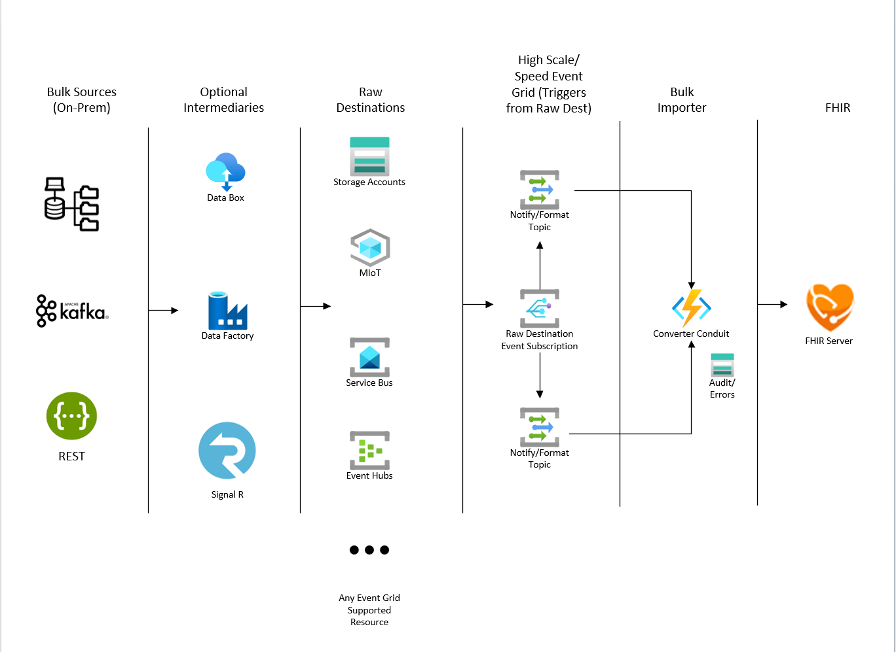

# FHIR Bulk Loader

FHIR Event Processor is an Azure Function App solution that provides the following services for Bulk ingesting FHIR Resources into the FHIR Server:
 + Imports FHIR Bundles, NDJSON files into FHIR Server 
 + High Speed Parallel Event Grid triggers from storage accounts or other event grid resources.
 + Complete Auditing, Error logging and Retry for throttled transactions 

# Architecture Overview

## Deploying your own FHIR Bulk Loader

# Contributing

This project welcomes contributions and suggestions.  Most contributions require you to agree to a
Contributor License Agreement (CLA) declaring that you have the right to, and actually do, grant us
the rights to use your contribution. For details, visit https://cla.opensource.microsoft.com.

When you submit a pull request, a CLA bot will automatically determine whether you need to provide
a CLA and decorate the PR appropriately (e.g., status check, comment). Simply follow the instructions
provided by the bot. You will only need to do this once across all repos using our CLA.

This project has adopted the [Microsoft Open Source Code of Conduct](https://opensource.microsoft.com/codeofconduct/).
For more information see the [Code of Conduct FAQ](https://opensource.microsoft.com/codeofconduct/faq/) or
contact [opencode@microsoft.com](mailto:opencode@microsoft.com) with any additional questions or comments.

FHIR® is the registered trademark of HL7 and is used with the permission of HL7.
